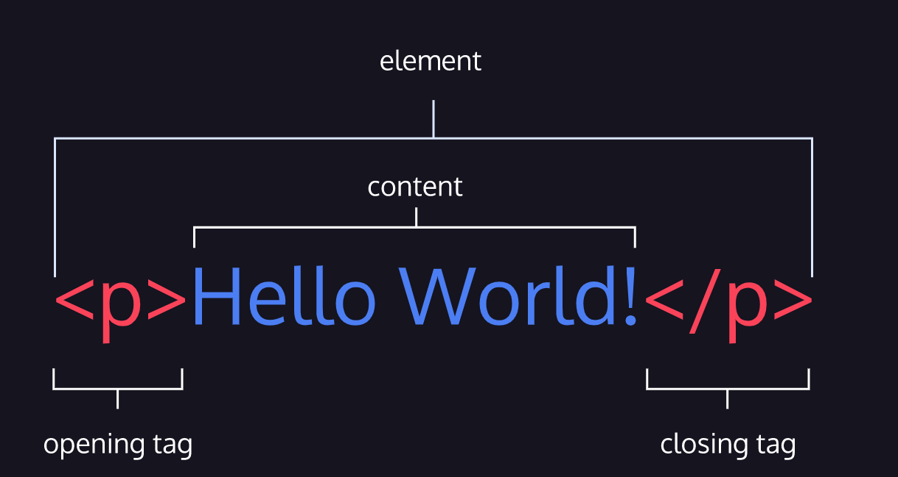

# 💻 Código de estado 404

Cuando un servidor responde a un cliente, el servidor especifica un código de estado como parte de la respuesta. Los códigos de estado indican si la solicitud HTTP se completó con éxito o no y, si hubo un error, contienen información sobre el tipo de error que ocurrió. El código de estado ayuda al navegador a saber cómo manejar los datos que se devolvieron con la respuesta.

Revise los estados HTTP a continuación y vea si alguno de ellos le resulta familiar.

